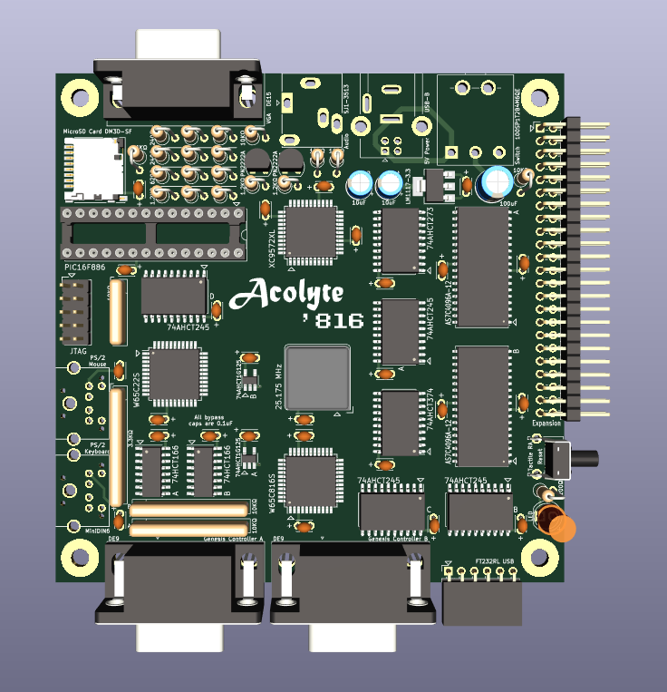

# Acolyte816

Currently building an Acolyte Computer using the W65C816S.

It will run at 12.5 MHz and have 1 MB of RAM.  Video output of 64-colors at 320x240 or 2-colors at 512x240.  PS/2 Keyboard and Mouse, 2x Genesis Controllers, and 1-Voice Square wave audio output.

This is a ROM-less design, having 512 bytes of bootloader code in the PIC16F886 'spoon feeding' the '816 on power-up or reset.  After that the PIC controls the MicroSD Card to access up to 2GB of memory.

