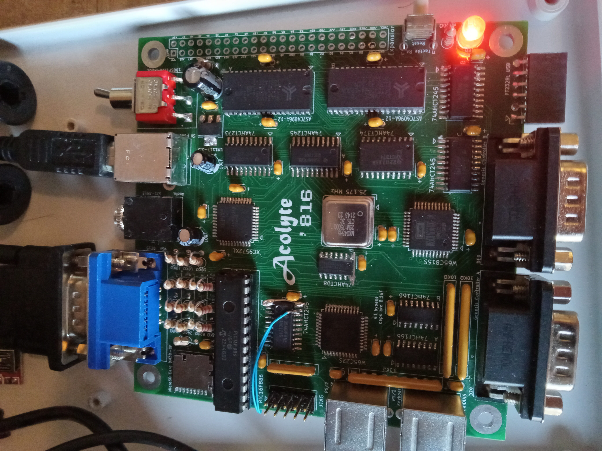
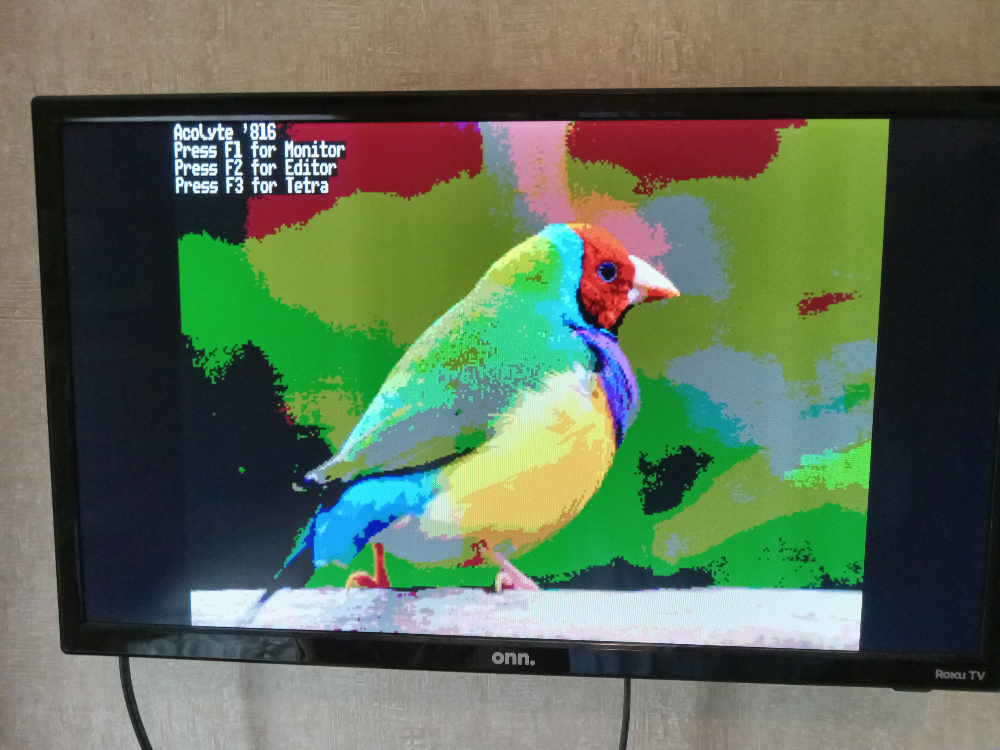
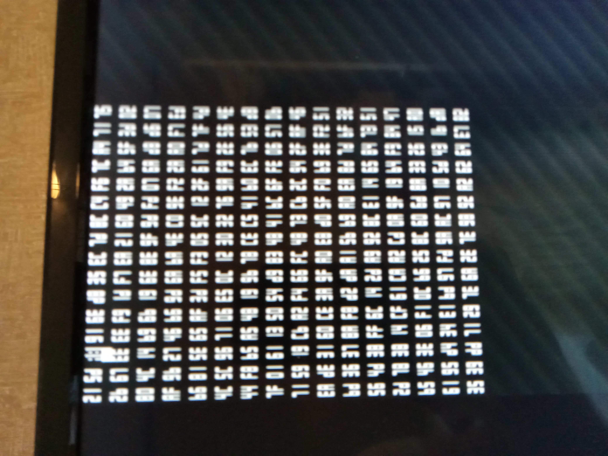
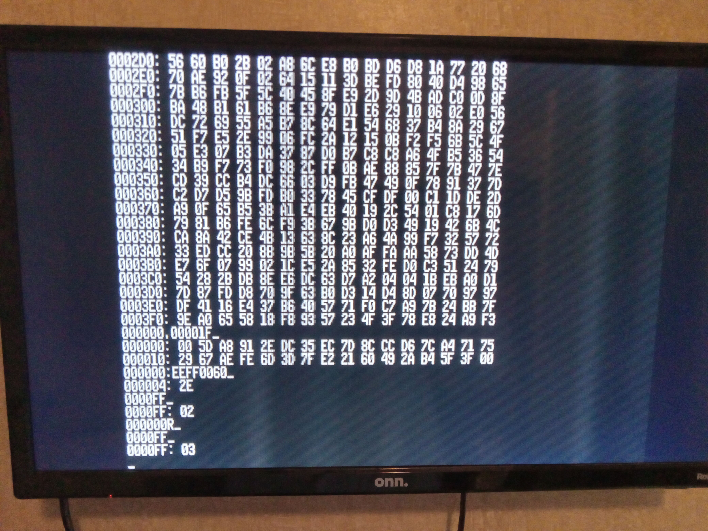
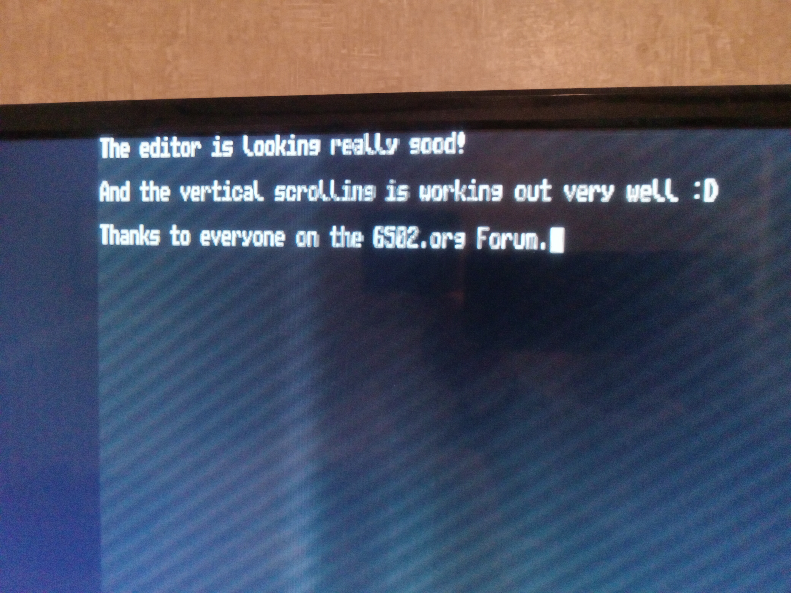
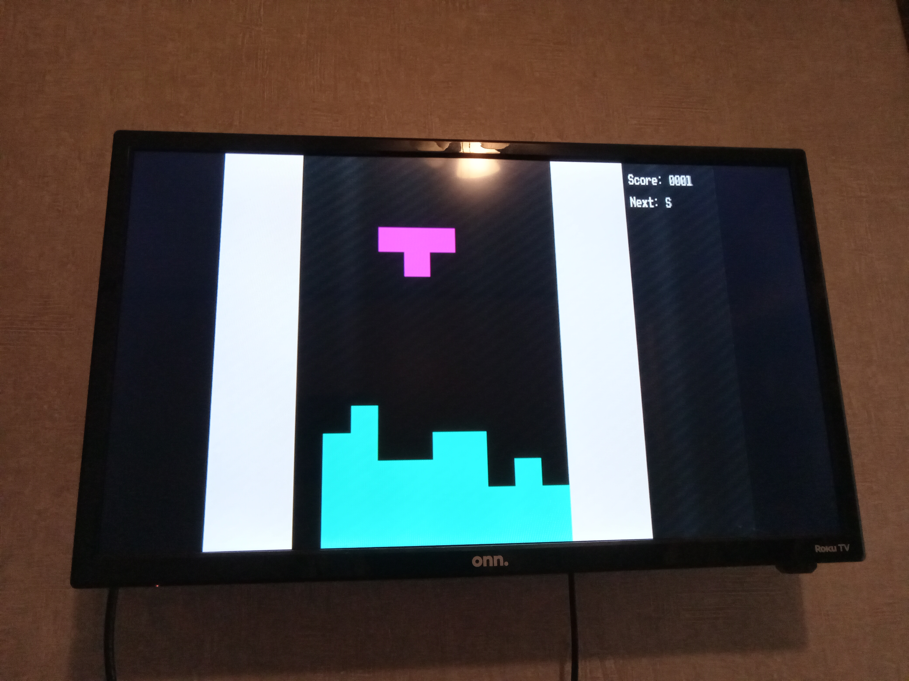

# Acolyte816

Currently building an Acolyte Computer using the W65C816S.

It will run at 12.5 MHz and have 1 MB of RAM.  Video output of 64-colors at 320x240 or monochrome at 512x240.  PS/2 Keyboard and Mouse, 2x Genesis Controllers, and 1-Voice Square wave audio output.

This is a ROM-less design, having 512 bytes of bootloader code in the PIC16F886 "spoon feeding" the '816 on power-up or reset.  After that the PIC controls the MicroSD Card to access up to 2GB of memory.

The Simulator is powered by gianlucag's 6502 emulator library, with Agumander's W65C02 edits.  The LICENSE.txt pertains to the "mos6502-Edit816.h" and "mos6502-Edit816.cpp" files only.

BODGES REQUIRED:  The 74AHCT245 connected to the PIC needs two changes: 1) Pin 1 is no longer R/W but instead connected to +5V. 2) Pin 19 is connected to RC5.  Also, the FTDI USB 6-pin connector has RTS and DTS lines cut and no longer connected to RC4 and RC5.

A picture of the board after bodges.
<kbd>

</kbd>

Splash showing 64-colors and text display together.
<kbd>

</kbd>

Bootloader fallback monitor, when SDcard is not present.
<kbd>

</kbd>

Basic system monitor for read/write/execute.
<kbd>

</kbd>

Text editor with vertical scrolling, will be used as IDE for a higher level language soon.
<kbd>

</kbd>

First game for the system: Tetra!
<kbd>

</kbd>

