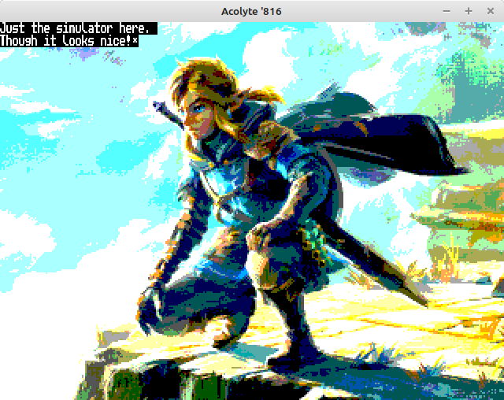

# Acolyte816

Currently building an Acolyte Computer using the W65C816S.

It will run at 12.5 MHz and have 1 MB of RAM.  Video output of 64-colors at 320x240 or monochrome at 512x240.  PS/2 Keyboard and Mouse, 2x Genesis Controllers, and 1-Voice Square wave audio output.

This is a ROM-less design, having 512 bytes of bootloader code in the PIC16F886 "spoon feeding" the '816 on power-up or reset.  After that the PIC controls the MicroSD Card to access up to 2GB of memory.

The Simulator is powered by gianlucag's 6502 emulator library, with Agumander's W65C02 edits.  The LICENSE.txt pertains to the "mos6502-Edit816.h" and "mos6502-Edit816.cpp" files only.

A picture of what the board will look like after getting it printed and soldered.

Demo showing 64-colors, text display, and keyboard input.

Bootloader monitor, a fallback when SDcard is not present.

